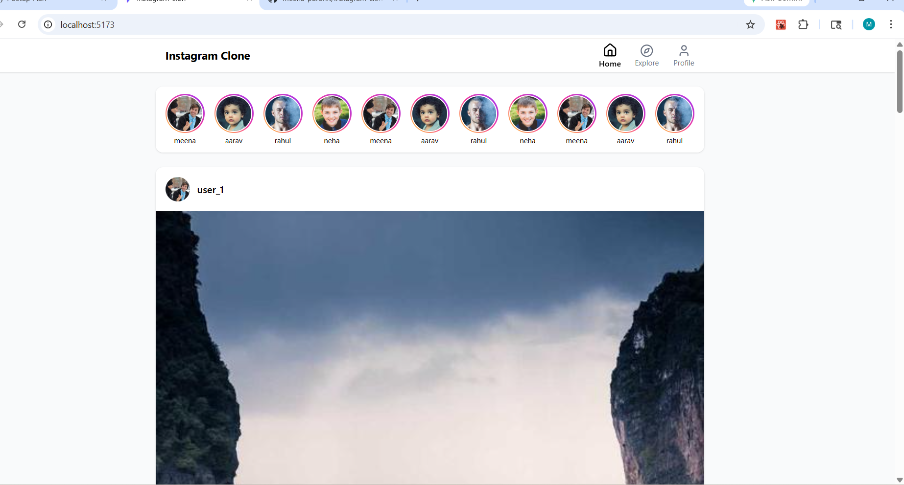
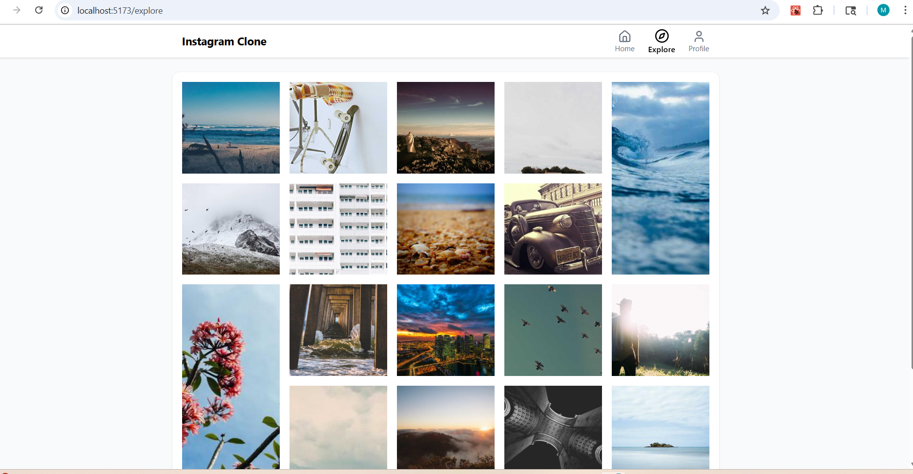
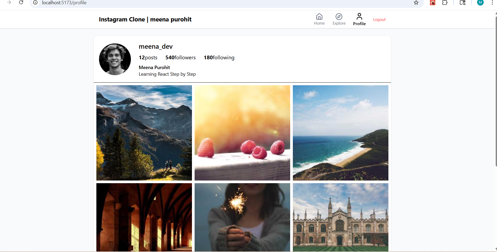
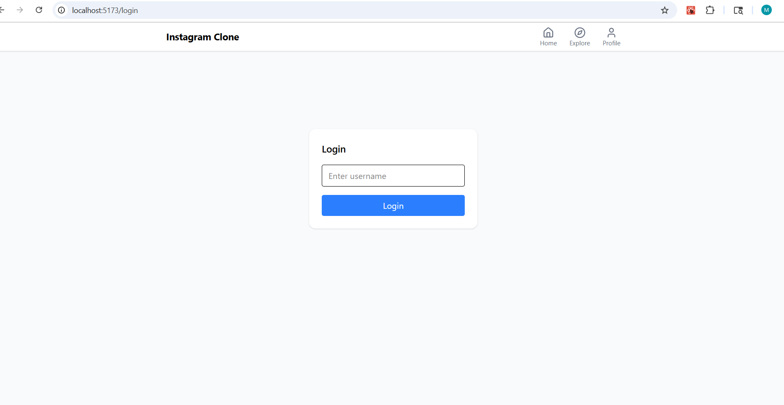

# 📸 Instagram Clone (Frontend)

A modern Instagram-inspired frontend application built using **React + Vite + Tailwind CSS**.

This project demonstrates real-world frontend architecture including routing, reusable components, API integration, protected routes, modal overlays, persistent comments, and responsive layouts.

---

# 🚀 Live Features

✔ Authentication system (mock login/logout)  
✔ Protected profile route  
✔ Story section UI (horizontal scroll)  
✔ Instagram-style Post Card component  
✔ Like toggle interaction  
✔ Modal post preview overlay  
✔ Comment system with LocalStorage persistence  
✔ Dynamic API-powered feed using Axios  
✔ Explore page masonry grid layout  
✔ Responsive profile gallery layout  
✔ Mobile-friendly bottom navigation  
✔ Active route highlighting  
✔ Context API global state management  

---

# 🧱 Tech Stack

Frontend:

- React (Component Architecture)
- Vite (Fast build tooling)
- Tailwind CSS (Utility-first styling)
- React Router v6 (Routing & layouts)
- Axios (API integration)
- Context API (Authentication state)

Architecture Concepts Used:

- Feature-based folder structure
- Reusable components
- Layout wrapper pattern
- Service-layer API separation
- Protected routes
- Modal overlay pattern
- LocalStorage persistence

---

# 📂 Folder Structure

src/

components/ → shared UI components  
features/ → feature-based modules  
layouts/ → layout wrappers  
pages/ → route-level screens  
services/ → API logic  
context/ → global auth state  
utils/ → helper functions  

This structure follows scalable frontend architecture practices.

---

# 🔐 Authentication Flow

Mock authentication implemented using:

- Context API
- LocalStorage persistence
- ProtectedRoute wrapper

Behavior:

User logs in  
Session stored locally  
Profile page unlocked  
Logout clears session  

---

# 📡 API Integration

Posts fetched from:

https://jsonplaceholder.typicode.com/photos

Images rendered dynamically using:

https://picsum.photos

Includes:

- loading states
- error handling
- dynamic rendering

---

# 💬 Comment Persistence Logic

Each post stores comments using:

localStorage

Key format:

comments-postId

This ensures:

comments remain after refresh  
comments stay isolated per post  

---

# 📱 Responsive Design Features

Mobile-first layout strategy:

- bottom navigation on mobile
- top navbar on desktop
- responsive grid galleries
- scalable avatar sizing

---

# 🖼 Screenshots

## 🖼 Screenshots

### Home Feed

### Explore Page

### Profile Page

### Login Screen

---

# ⚙️ Installation

Clone repository:

git clone https://github.com/meena-purohit/instagram-clon-react

# 🌐 Live Demo
http://instagram-clon-react.vercel.app/

Install dependencies:

npm install

Run development server:

npm run dev

---

# 📈 Future Improvements

Possible upgrades:

- backend authentication
- real comment API
- image upload support
- dark mode toggle
- Redux Toolkit integration

---

# 👩‍💻 Author

Meena Purohit

Frontend Developer (React Learner → Software Engineer Journey 🚀)